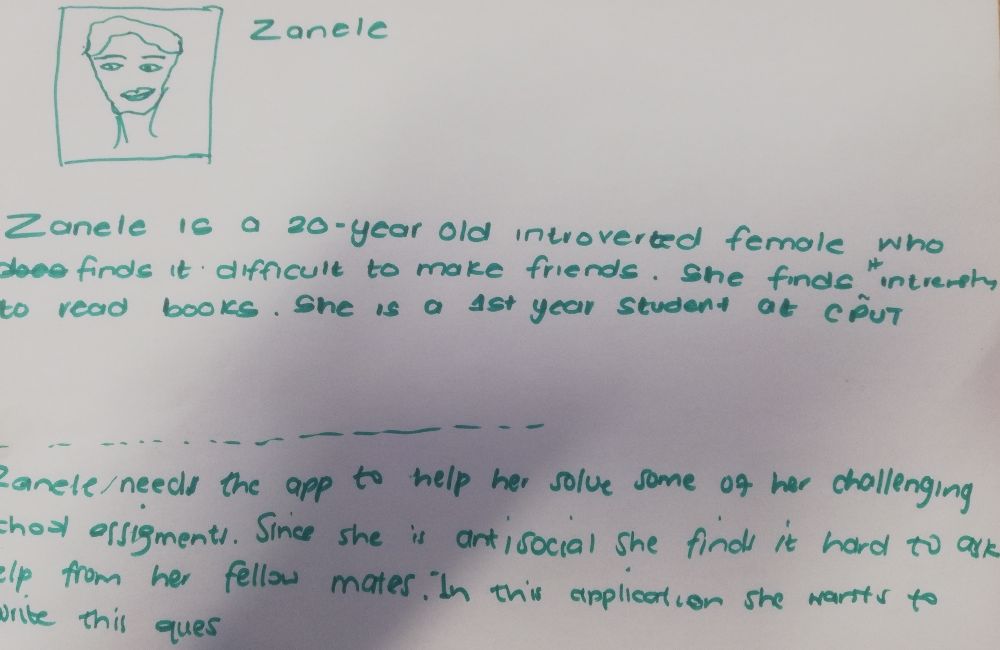
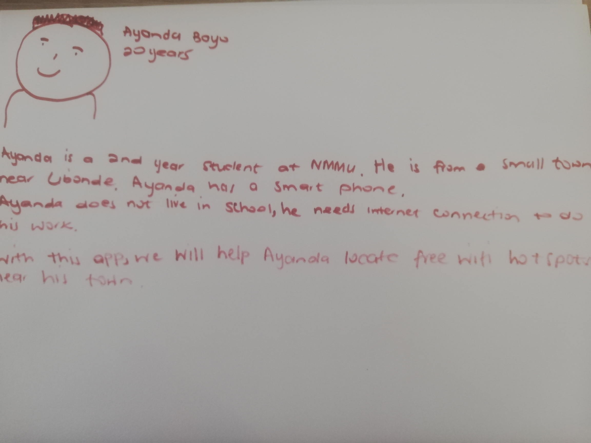

# Edu-Learn

Edu-Learn is an educational platform that allows students to find nearest hotspots, study resources and links
them to tutors so that they can be able to learn effectively.

## Data Model
---

## Khanban

---
## Persona 1

---
## Persona 2

---
## Prototype

